# NyaySetu

Landing Website

#### Screenshots:

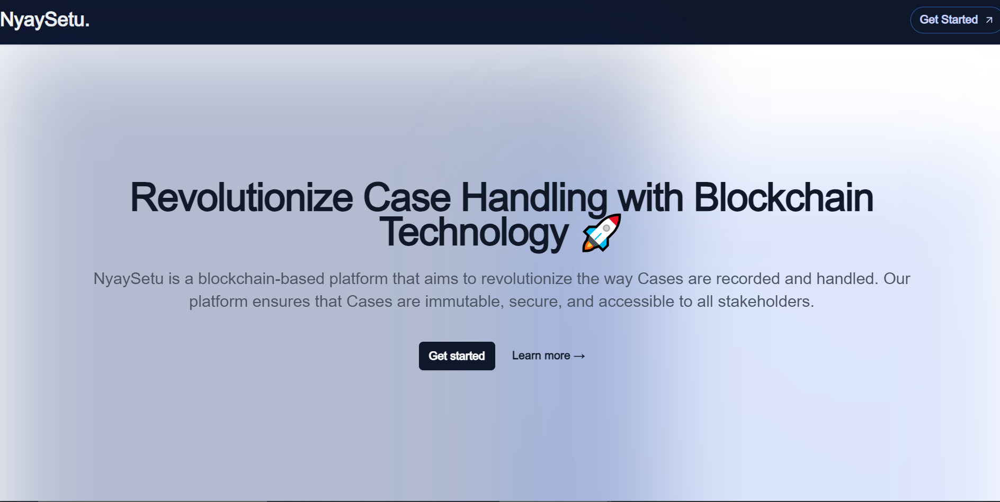

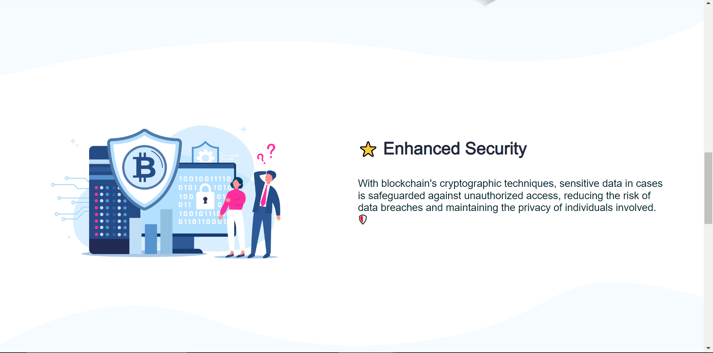
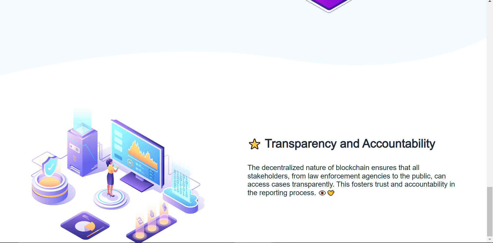

Court Dashboard

#### Features:

- [x] Listing and real-time tracking of **Court Cases** 
- [x] **Create New Case** form with **Blockchain Integration** for storing the case details 
- [x] Update Case Details with **Blockchain Transactions** for ensuring transparency 
- [x] **Schedule Meeting** feature for connecting with lawyers, plaintiffs, and defendants

#### Screenshots:

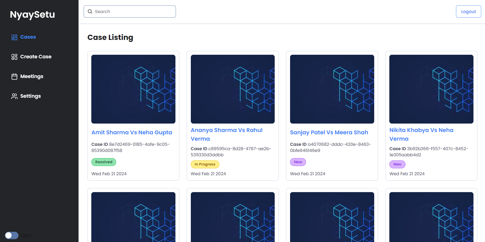
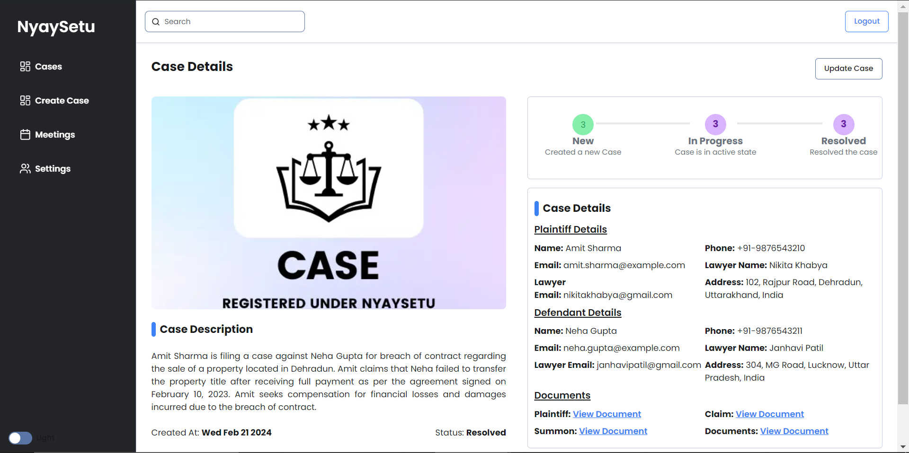
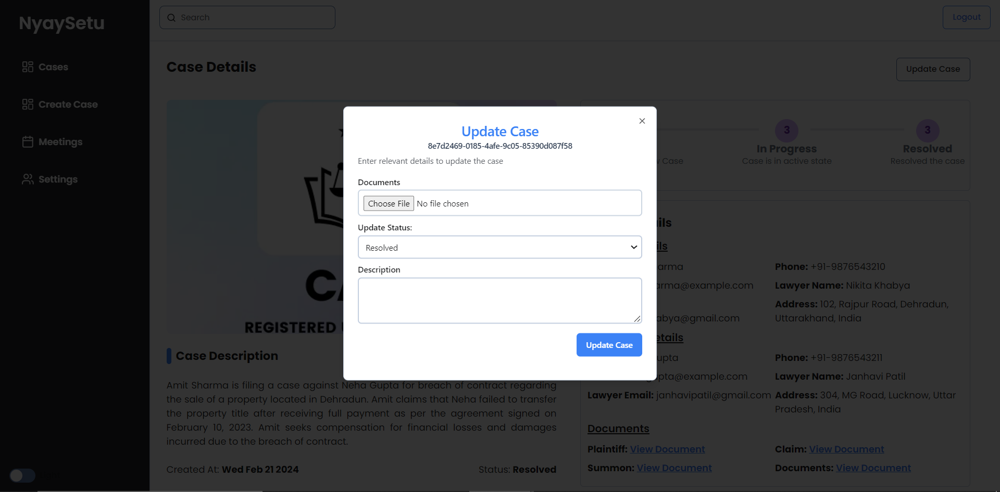
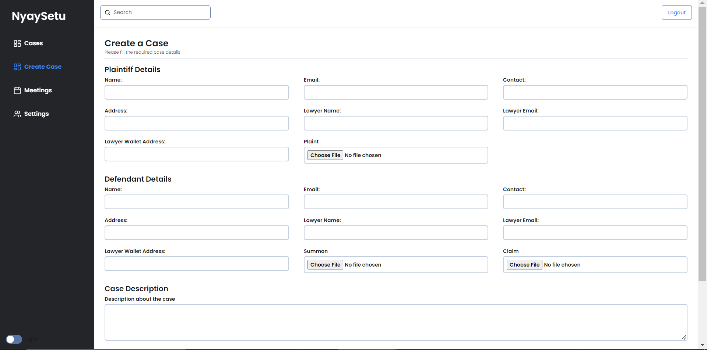
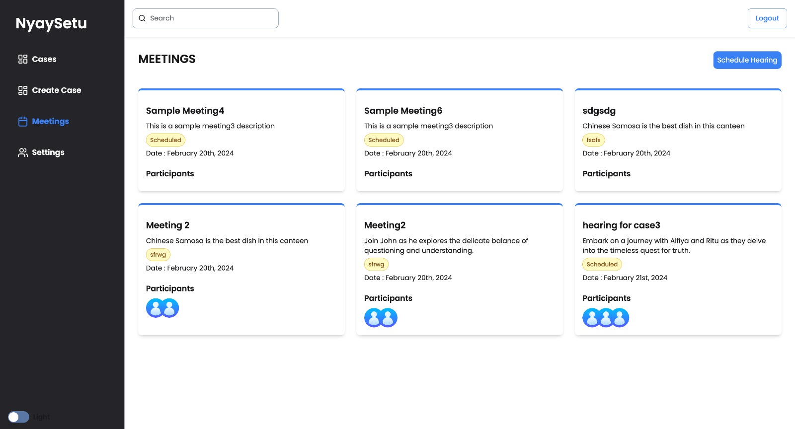

Lawyer Dashboard

#### Features:

- [x] Listing and real-time tracking of **Court Cases** that the lawyer is handling
- [x] View Case Details with **Blockchain Transactions** for ensuring transparency
- [x] Attend Meetings scheduled by the court or the plaintiff
- [x]  AI-powered Legal Assistant for providing legal advice and suggestions

#### Screenshot:

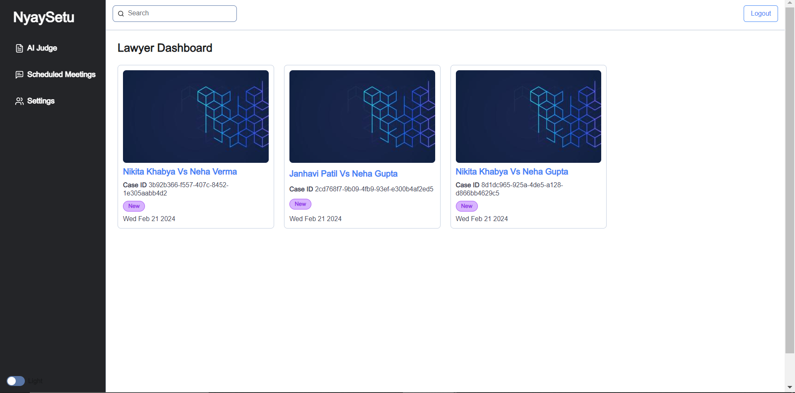
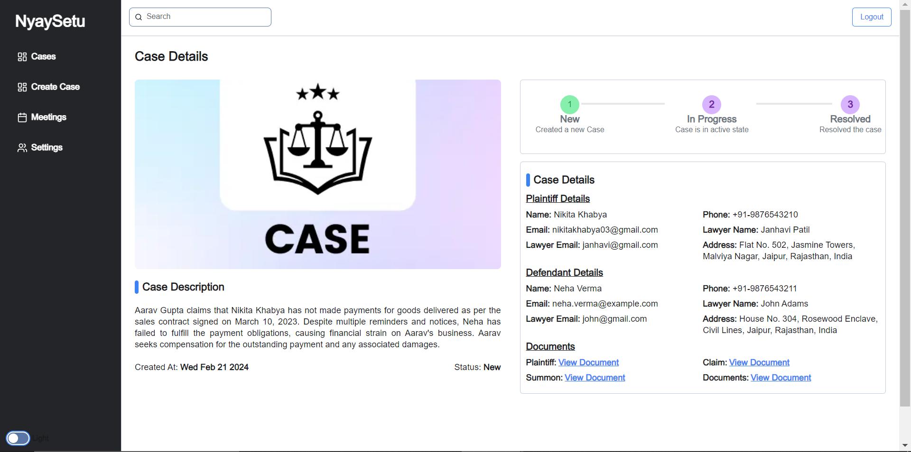
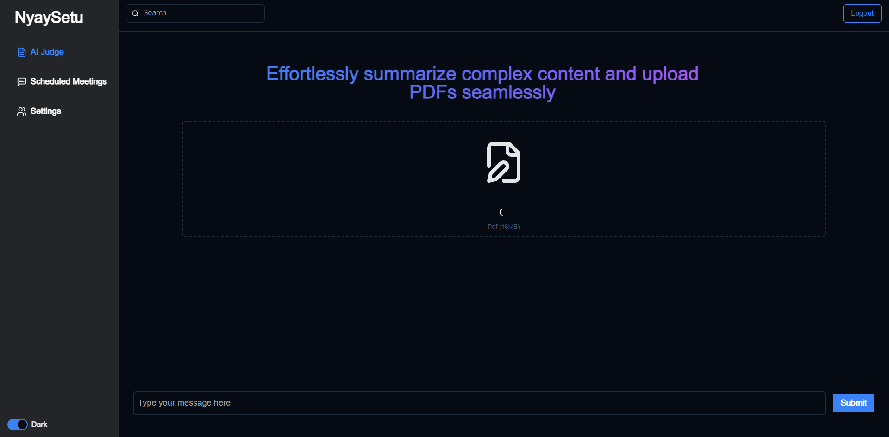
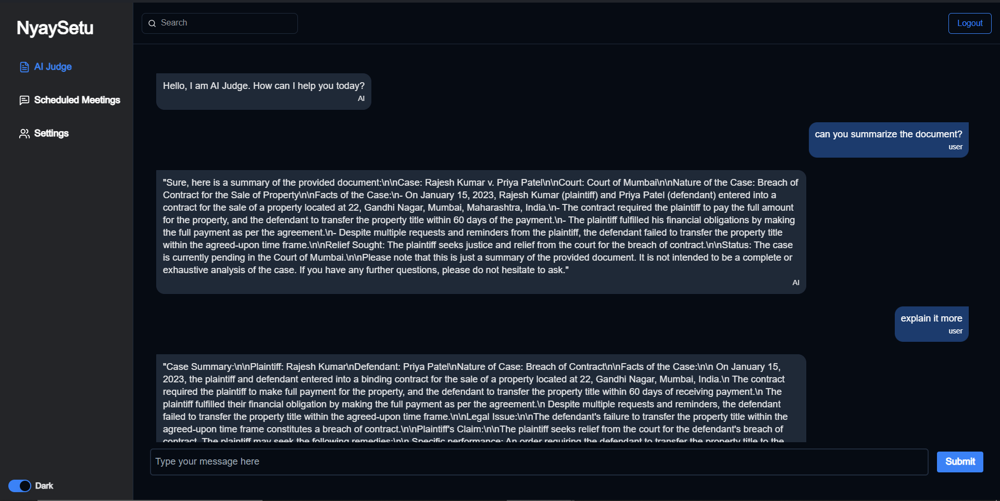
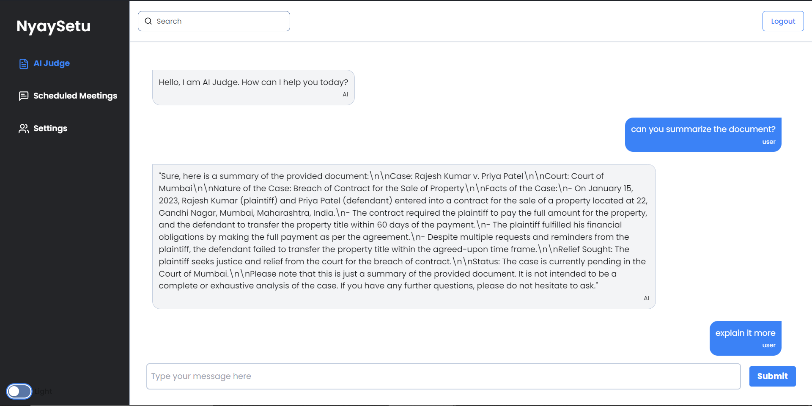

User

#### Features:

- [x] User(Pllaintiff/Defendant) recive and email with the case details once the case is created
- [x] User can view the case details and the status of the case
- [x] User can view the meetings scheduled by the court

#### Screenshot:

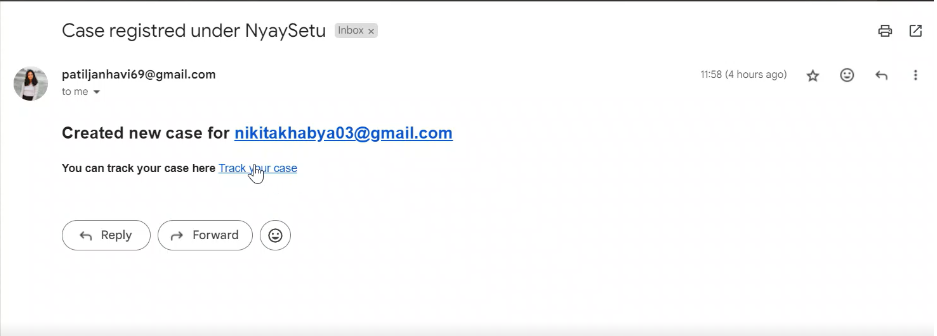
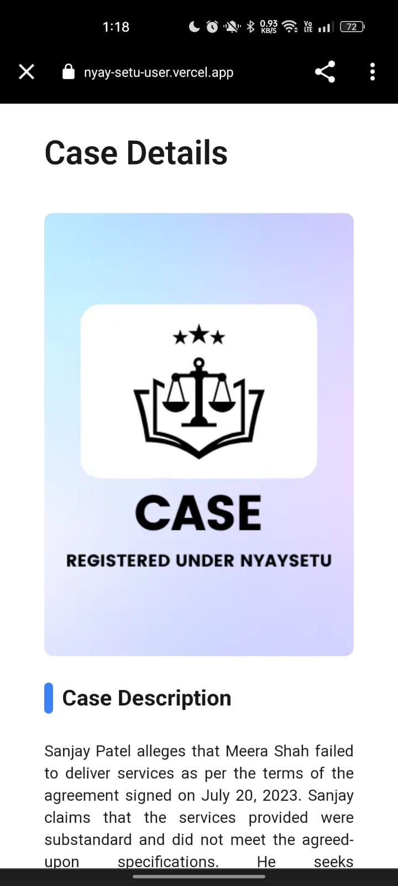
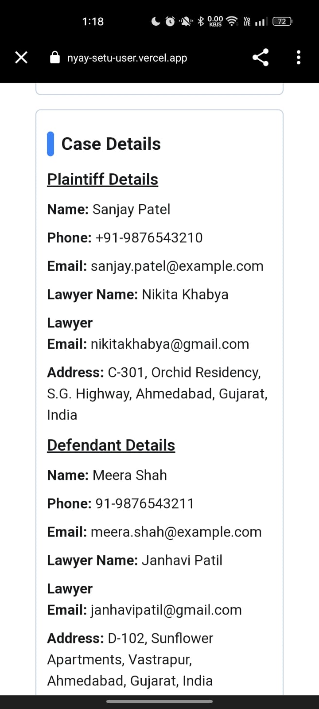

